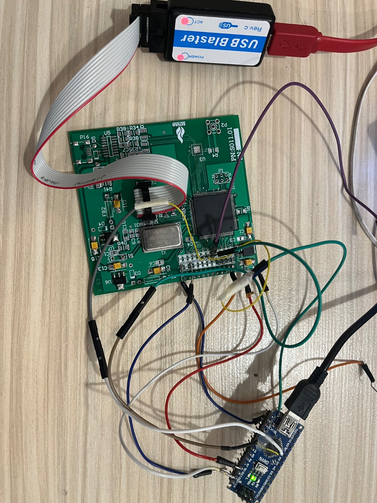
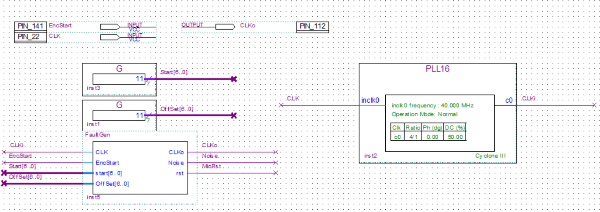
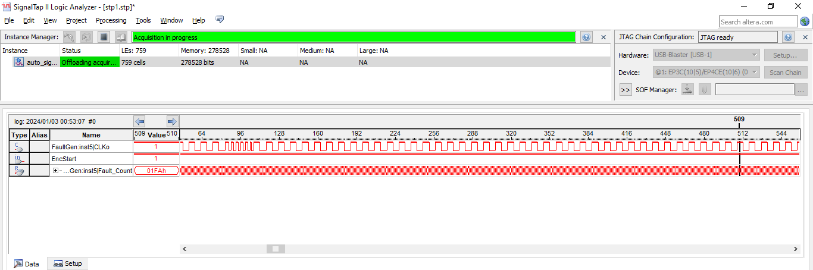
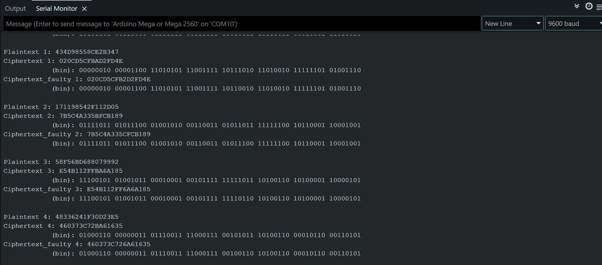
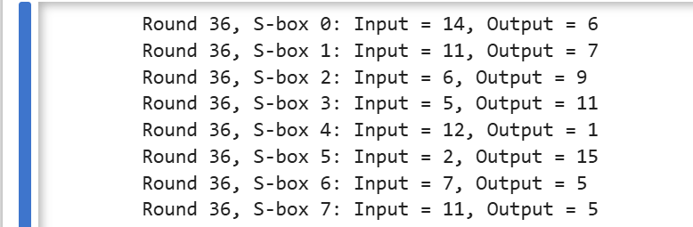
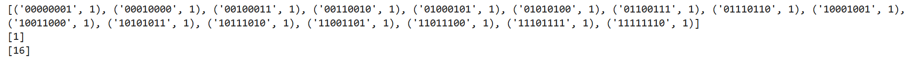
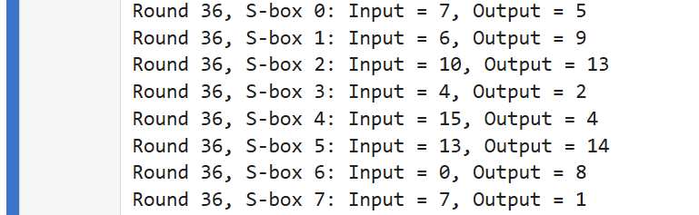
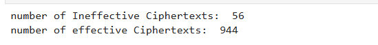
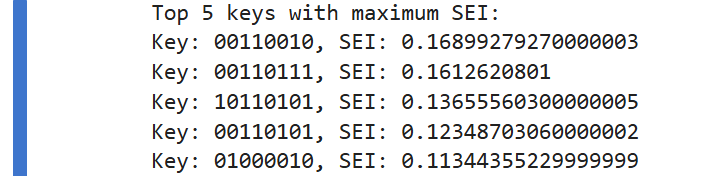
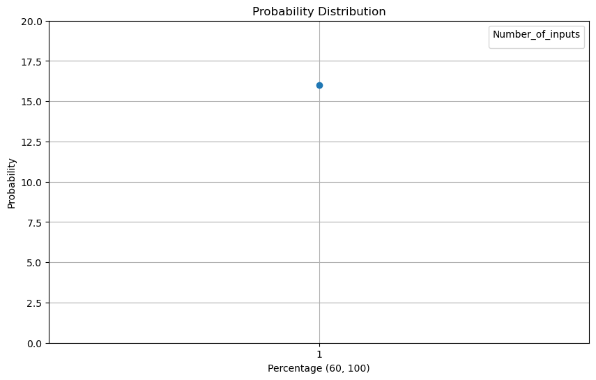

# LIFA-SIFA-on-TWINE

# LFA-on-Twine
Linked Ineffective Fault Analysis (LIFA) is an emerging fault attack technique within symmetric-key cryptography that eliminates the need for input control and effectively circumvents redundancy-based countermeasures. While it builds upon similar assumptions as Statistical Ineffective Fault Analysis (SIFA), LIFA exhibits improved resilience to noise, positioning it as a robust alternative in practical fault analysis. To date, most studies have focused on its application to Substitution-Permutation Network (SPN) ciphers, leaving a gap in our understanding of its effectiveness against lightweight block ciphers based on Generalized Feistel Networks (GFNs), such as TWINE. Additionally, the impact of multiple concurrent faults within the LIFA framework has not been fully explored. This paper addresses these limitations by applying LIFA to the TWINE cipher—a 64-bit lightweight block cipher with a 16-branch GFN structure—highlighting unique structural properties that support the generation of dual fault linkages. These simultaneous fault paths substantially increase the efficiency and success rate of key recovery. Our evaluation, conducted through both simulation and real-world fault injection using frequency glitching on an ATMEGA328p microcontroller, demonstrates that the proposed approach not only adapts LIFA effectively to the GFN architecture of TWINE but also achieves superior results compared to conventional techniques such as SIFA. These findings contribute to a deeper understanding of fault vulnerability in modern lightweight cryptographic designs.

# 1)Implementation
The implementation involves using an FPGA(cyclone ec3c5e144c8) and an Arduino to execute the TWINE encryption algorithm(in ATmega328p) while injecting faults to analyze their impact. The FPGA, programmed using VHDL in Quartus, generates an external clock signal for the Arduino, ensuring synchronization. The Arduino runs the TWINE algorithm and receives timing signals to determine the precise moments for fault injection. Faults are introduced by modifying two predefined values in Quartus, affecting the encryption process. The system monitors input and output data in real-time to observe the effects of these faults on TWINE execution.


# 1.1)VHDL
In implementation first step is generating clock glitch in FPGA with VHDL for the cyclones:

```vhdl
LIBRARY IEEE;
USE IEEE.STD_LOGIC_1164.ALL;
USE IEEE.STD_LOGIC_UNSIGNED.ALL;
ENTITY FaultGen IS
	PORT(	CLK				: IN		STD_LOGIC;
			EncStart		: IN		STD_LOGIC;
			start1			: IN		STD_LOGIC_VECTOR(12 DOWNTO 0);
			OffSet1			: IN		STD_LOGIC_VECTOR(6 DOWNTO 0);
			start2			: IN		STD_LOGIC_VECTOR(12 DOWNTO 0);
			OffSet2			: IN		STD_LOGIC_VECTOR(6 DOWNTO 0);
			CLKo			: BUFFER	STD_LOGIC;
			Noise			: OUT		STD_LOGIC;
			rst				: OUT		STD_LOGIC
			);
END FaultGen;
ARCHITECTURE behavioral OF FaultGen IS
	SIGNAL CLK4M_Count					: STD_LOGIC_VECTOR(3 DOWNTO 0);
	SIGNAL EncStartS					: STD_LOGIC_VECTOR(3 DOWNTO 0);
	SIGNAL Fault_Count					: STD_LOGIC_VECTOR(14 DOWNTO 0);
BEGIN
	PROCESS(CLK)
	BEGIN
		IF RISING_EDGE(CLK) THEN
			EncStartS	<= EncStartS(2 DOWNTO 0) & EncStart;
			IF Fault_Count <32000 THEN
				Fault_Count	<= Fault_Count+1;
				Noise		<= '0';
			ELSE
				Noise	<= '1';
			END IF;
			Noise	<= '0';
			IF (Fault_Count>Start1 AND Fault_Count<(Start1+OffSet1)) OR
			   (Fault_Count>Start2 AND Fault_Count<(Start2+OffSet2)) THEN
				--CLKo	<= NOT CLKo;
				IF CLK4M_Count <3 THEN
					CLK4M_Count	<= CLK4M_Count+1;
				ELSE
					CLK4M_Count<= (OTHERS=>'0');
				END IF;
				IF CLK4M_Count <2 THEN
					CLKo		<= '0';
				ELSE
					CLKo	<= '1';
				END IF;
--				CLK4M_Count	<= "0011";
				Noise		<= '1';
			ELSE
				IF CLK4M_Count <9 THEN
					CLK4M_Count	<= CLK4M_Count+1;
				ELSE
					CLK4M_Count<= (OTHERS=>'0');
				END IF;
				IF CLK4M_Count <5 THEN
					CLKo		<= '0';
				ELSE
					CLKo	<= '1';
				END IF;
			END IF;
			IF EncStartS="0011" THEN
				Fault_Count<= (OTHERS=>'0');
			END IF;
		END IF;
	END PROCESS;
END behavioral;
```
We have been able to produce the frequency glitch as shown in the figure below, and it should be noted that we have created two values ​​start and offset, so that we can create the glitch anywhere we want and multiply the frequency instantly.



# 1.2)Arduino 
I implemented the DES encryption algorithm on an Arduino, using an external FPGA to provide the clock signal. To analyze fault effects, I injected faults at specific execution points by utilizing a trigger signal generated by the FPGA. A dedicated GPIO pin on the Arduino receives this trigger, allowing precise fault injection during critical operations such as the last-round S-Box computation. The effects of faults are observed via the UART serial output, enabling analysis of fault propagation and potential vulnerabilities in TWINE.

```C
#include <Arduino.h>

// S-box
const uint8_t SBOX[16] = {
  0x0C, 0x00, 0x0F, 0x0A, 0x02, 0x0B, 0x09, 0x05,
  0x08, 0x03, 0x0D, 0x07, 0x01, 0x0E, 0x06, 0x04
};

// Permutation table
const uint8_t SHUF[16] = {
  5, 0, 1, 4, 7, 12, 3, 8,
  13, 6, 9, 2, 15, 10, 11, 14
};

// Round constants
const uint8_t ROUND_CONST[36] = {
  0x01, 0x02, 0x04, 0x08, 0x10, 0x20, 0x03, 0x06, 0x0C, 0x18,
  0x30, 0x23, 0x05, 0x0A, 0x14, 0x28, 0x13, 0x26, 0x0F, 0x1E,
  0x3C, 0x3B, 0x35, 0x29, 0x11, 0x22, 0x07, 0x0E, 0x1C, 0x38,
  0x33, 0x25, 0x09, 0x12, 0x24, 0x0B
};

uint8_t rk[36][8];

void expandKeys80(const uint8_t* key) {
  uint8_t wk[20];
  for (int i = 0; i < 10; i++) {
    wk[2 * i] = key[i] >> 4;
    wk[2 * i + 1] = key[i] & 0x0F;
  }

  for (int r = 0; r < 36; r++) {
    rk[r][0] = wk[1];
    rk[r][1] = wk[3];
    rk[r][2] = wk[4];
    rk[r][3] = wk[6];
    rk[r][4] = wk[13];
    rk[r][5] = wk[14];
    rk[r][6] = wk[15];
    rk[r][7] = wk[16];

    if (r != 35) {
      wk[1] ^= SBOX[wk[0]];
      wk[4] ^= SBOX[wk[16]];
      wk[7] ^= ROUND_CONST[r] >> 3;
      wk[19] ^= ROUND_CONST[r] & 0x07;

      uint8_t tmp0 = wk[0], tmp1 = wk[1], tmp2 = wk[2], tmp3 = wk[3];
      for (int j = 0; j < 4; j++) {
        wk[j*4 + 0] = wk[j*4 + 4];
        wk[j*4 + 1] = wk[j*4 + 5];
        wk[j*4 + 2] = wk[j*4 + 6];
        wk[j*4 + 3] = wk[j*4 + 7];
      }
      wk[16] = tmp1;
      wk[17] = tmp2;
      wk[18] = tmp3;
      wk[19] = tmp0;
    }
  }
}

void twineEncrypt(uint8_t* dst, const uint8_t* src) {
  uint8_t x[16];

  for (int i = 0; i < 8; i++) {
    x[2*i] = src[i] >> 4;
    x[2*i+1] = src[i] & 0x0F;
  }

  for (int r = 0; r < 35; r++) {
    for (int j = 0; j < 8; j++) {
      x[2*j+1] ^= SBOX[x[2*j] ^ rk[r][j]];
    }

    uint8_t xnext[16];
    for (int h = 0; h < 16; h++) {
      xnext[SHUF[h]] = x[h];
    }
    memcpy(x, xnext, 16);
  }

  // Round 35 with trigger
  digitalWrite(2, HIGH); // Trigger HIGH before S-box
  for (int j = 0; j < 8; j++) {
    x[2*j+1] ^= SBOX[x[2*j] ^ rk[35][j]];
  }
  digitalWrite(2, LOW); // Trigger LOW after S-box

  for (int i = 0; i < 8; i++) {
    dst[i] = (x[2*i] << 4) | x[2*i+1];
  }
}

void printHex(const uint8_t* data, int len) {
  for (int i = 0; i < len; i++) {
    if (data[i] < 0x10) Serial.print("0");
    Serial.print(data[i], HEX);
  }
  Serial.println();
}

void printBinary(const uint8_t* data, int len) {
  for (int i = 0; i < len; i++) {
    for (int b = 7; b >= 0; b--) {
      Serial.print((data[i] >> b) & 1);
    }
    Serial.print(" ");
  }
  Serial.println();
}

void setup() {
  Serial.begin(9600);
  delay(500);
  pinMode(2, OUTPUT); // Trigger pin
  digitalWrite(2, LOW); // Ensure it starts low

  uint8_t key[10] = {0x00, 0x11, 0x22, 0x33, 0x44, 0x55, 0x66, 0x77, 0x88, 0x99};
  expandKeys80(key);

  for (int t = 0; t < 100; t++) {
    uint8_t plaintext[8];
    uint8_t ciphertext[8];

    for (int i = 0; i < 8; i++) {
      plaintext[i] = random(0, 256);
    }

    twineEncrypt(ciphertext, plaintext);

    Serial.print("Plaintext "); Serial.print(t); Serial.print(": ");
    printHex(plaintext, 8);
    Serial.print("            (bin): ");
    printBinary(plaintext, 8);

    Serial.print("Ciphertext "); Serial.print(t); Serial.print(": ");
    printHex(ciphertext, 8);
    Serial.print("            (bin): ");
    printBinary(ciphertext, 8);

    Serial.println();
  }
}

void loop() {
  // Do nothing
}
```
In the image below we see where the fault injected:



This fault occurred between certain nibbles, as shown in the schematic:
**a**


The fualty ciphertexts and nonfaulty ciphertexs in implementation are saved in (lifa-twine.txt). We use them in key recovery.

# 2)Simulation
I used python program language to produce the faulty and nonfaulty ciphertexts like implementation. This simulation for Twine code for generate plaintexts and ciphertexts is:

# 2.1) Linked Ineffective Fault Analysis (LIFA)

```python

from collections import defaultdict as ddict
import random
import string
import binascii
from math import ceil
import numpy as np
import csv


sbox = {
    0x0: 0xC,
    0x1: 0x0,
    0x2: 0xF,
    0x3: 0xA,
    0x4: 0x2,
    0x5: 0xB,
    0x6: 0x9,
    0x7: 0x5,
    0x8: 0x8,
    0x9: 0x3,
    0xA: 0xD,
    0xB: 0x7,
    0xC: 0x1,
    0xD: 0xE,
    0xE: 0x6,
    0xF: 0x4,
}

permutation_enc = {
    0x0: 0x5,
    0x1: 0x0,
    0x2: 0x1,
    0x3: 0x4,
    0x4: 0x7,
    0x5: 0xC,
    0x6: 0x3,
    0x7: 0x8,
    0x8: 0xD,
    0x9: 0x6,
    0xA: 0x9,
    0xB: 0x2,
    0xC: 0xF,
    0xD: 0xA,
    0xE: 0xB,
    0xF: 0xE,
}

permutation_dec = {
    0x0: 0x1,
    0x1: 0x2,
    0x2: 0xB,
    0x3: 0x6,
    0x4: 0x3,
    0x5: 0x0,
    0x6: 0x9,
    0x7: 0x4,
    0x8: 0x7,
    0x9: 0xA,
    0xA: 0xD,
    0xB: 0xE,
    0xC: 0x5,
    0xD: 0x8,
    0xE: 0xF,
    0xF: 0xC,
}

con = {
    0x01: 0x01,
    0x02: 0x02,
    0x03: 0x04,
    0x04: 0x08,
    0x05: 0x10,
    0x06: 0x20,
    0x07: 0x03,
    0x08: 0x06,
    0x09: 0x0C,
    0x0A: 0x18,
    0x0B: 0x30,
    0x0C: 0x23,
    0x0D: 0x05,
    0x0E: 0x0A,
    0x0F: 0x14,
    0x10: 0x28,
    0x11: 0x13,
    0x12: 0x26,
    0x13: 0x0F,
    0x14: 0x1E,
    0x15: 0x3C,
    0x16: 0x3B,
    0x17: 0x35,
    0x18: 0x29,
    0x19: 0x11,
    0x1A: 0x22,
    0x1B: 0x07,
    0x1C: 0x0E,
    0x1D: 0x1C,
    0x1E: 0x38,
    0x1F: 0x33,
    0x20: 0x25,
    0x21: 0x09,
    0x22: 0x12,
    0x23: 0x24,
}

key_space = [
    string.ascii_lowercase,
    string.ascii_uppercase,
    string.digits
]

def _S(i):
    return sbox[i]


def _CON_L(r):
    return con[r] & 0b111


def _CON_H(r):
    return con[r] >> 3 & 0b111


def _Rot4(bits):
    return bits[1:] + bits[:1]


def _Rot16(bits):
    return bits[4:] + bits[:4]


def _get_4_bits(source, pos):
    return source >> pos * 4 & 0xF


def _append_4_bits(source, bits):
    return source << 4 | bits


def _key_schedule_80(key):
    RK_32, WK_80 = ddict(ddict), []
    for i in range(20):
        WK_80.append(_get_4_bits(key, 20 - 1 - i))
    for r in range(1, 36):
        (
            RK_32[r][0],
            RK_32[r][1],
            RK_32[r][2],
            RK_32[r][3],
            RK_32[r][4],
            RK_32[r][5],
            RK_32[r][6],
            RK_32[r][7],
        ) = (
            WK_80[1],
            WK_80[3],
            WK_80[4],
            WK_80[6],
            WK_80[13],
            WK_80[14],
            WK_80[15],
            WK_80[16],
        )
        WK_80[1] = WK_80[1] ^ _S(WK_80[0])
        WK_80[4] = WK_80[4] ^ _S(WK_80[16])
        WK_80[7] = WK_80[7] ^ _CON_H(r)
        WK_80[19] = WK_80[19] ^ _CON_L(r)
        WK0_to_WK3_16 = _Rot4(WK_80[:4])
        for j in range(len(WK0_to_WK3_16)):
            WK_80[j] = WK0_to_WK3_16[j]
        WK0_to_WK19_80 = _Rot16(WK_80[:20])
        for k in range(len(WK0_to_WK19_80)):
            WK_80[k] = WK0_to_WK19_80[k]
    (
        RK_32[36][0],
        RK_32[36][1],
        RK_32[36][2],
        RK_32[36][3],
        RK_32[36][4],
        RK_32[36][5],
        RK_32[36][6],
        RK_32[36][7],
    ) = (
        WK_80[1],
        WK_80[3],
        WK_80[4],
        WK_80[6],
        WK_80[13],
        WK_80[14],
        WK_80[15],
        WK_80[16],
    )
    return RK_32


def _key_schedule_128(key):
    RK_32, WK_128 = ddict(ddict), []
    for i in range(32):
        WK_128.append(_get_4_bits(key, 32 - 1 - i))
    for r in range(1, 36):
        (
            RK_32[r][0],
            RK_32[r][1],
            RK_32[r][2],
            RK_32[r][3],
            RK_32[r][4],
            RK_32[r][5],
            RK_32[r][6],
            RK_32[r][7],
        ) = (
            WK_128[2],
            WK_128[3],
            WK_128[12],
            WK_128[15],
            WK_128[17],
            WK_128[18],
            WK_128[28],
            WK_128[31],
        )
        WK_128[1] = WK_128[1] ^ _S(WK_128[0])
        WK_128[4] = WK_128[4] ^ _S(WK_128[16])
        WK_128[23] = WK_128[23] ^ _S(WK_128[30])
        WK_128[7] = WK_128[7] ^ _CON_H(r)
        WK_128[19] = WK_128[19] ^ _CON_L(r)
        WK0_to_WK3_16 = _Rot4(WK_128[:4])
        for j in range(len(WK0_to_WK3_16)):
            WK_128[j] = WK0_to_WK3_16[j]
        WK0_to_WK31_128 = _Rot16(WK_128[:32])
        for k in range(len(WK0_to_WK31_128)):
            WK_128[k] = WK0_to_WK31_128[k]
    (
        RK_32[36][0],
        RK_32[36][1],
        RK_32[36][2],
        RK_32[36][3],
        RK_32[36][4],
        RK_32[36][5],
        RK_32[36][6],
        RK_32[36][7],
    ) = (
        WK_128[2],
        WK_128[3],
        WK_128[12],
        WK_128[15],
        WK_128[17],
        WK_128[18],
        WK_128[28],
        WK_128[31],
    )
    return RK_32


def _encrypt(P, RK, block_index):
    RK_32, X_16, C = dict(RK), ddict(lambda: ddict(int)), 0x0
    
    for i in range(16):
        X_16[1][i] = _get_4_bits(P, 16 - 1 - i)
    for i in range(1, 36):
        for j in range(0, 8):
            X_16[i][2 * j + 1] = _S(X_16[i][2 * j] ^ RK_32[i][j]) ^ X_16[i][2 * j + 1]

        for h in range(0, 16):
            X_16[i + 1][permutation_enc[h]] = X_16[i][h]
    for j in range(0, 8):
        X_16[36][2 * j + 1] = _S(X_16[36][2 * j] ^ RK_32[36][j]) ^ X_16[36][2 * j + 1]
    for i in range(16):
        C = _append_4_bits(C, X_16[36][i])
    return C


def _decrypt(C, RK):
    RK_32, X_16, P = dict(RK), ddict(lambda: ddict(int)), 0x0
    for i in range(16):
        X_16[36][i] = _get_4_bits(C, 16 - 1 - i)
    for i in range(36, 1, -1):
        for j in range(0, 8):
            X_16[i][2 * j + 1] = _S(X_16[i][2 * j] ^ RK_32[i][j]) ^ X_16[i][2 * j + 1]
        for h in range(0, 16):
            X_16[i - 1][permutation_dec[h]] = X_16[i][h]
    for j in range(0, 8):
        X_16[1][2 * j + 1] = _S(X_16[1][2 * j] ^ RK_32[1][j]) ^ X_16[1][2 * j + 1]
    for i in range(16):
        P = _append_4_bits(P, X_16[1][i])
    return P


# def __generate_key(key_size):
#     space = "".join(key_space)
#     if key_size == 0x50:
#         return "".join(random.choice(space) for i in range(0x0A))
#     elif key_size == 0x80:
#         return "".join(random.choice(space) for i in range(0x10))

def __generate_RK(key, key_size):
    if key_size == 0x50:
        return _key_schedule_80(int(key.encode("utf-8").hex(), 16))
    else:
        return _key_schedule_128(int(key.encode("utf-8").hex(), 16))

def __iterblocks(blocks):
    for i in range(ceil(len(blocks) / 16)):
        if i * 16 + 16 > len(blocks):
            yield blocks[i * 16 : len(blocks)]
        else:
            yield blocks[i * 16 : i * 16 + 16]

def encrypt(key, plaintext):
    _c = ""
    plaintext = plaintext.encode("utf-8").hex()
    RK = __generate_RK(key, 0x80)
    for block_index, block in enumerate(__iterblocks(plaintext)):
        cblock = hex(_encrypt(int(block, 16), RK, block_index))[2:]
        _c += cblock
    # print(RK)
    return _c

def decrypt(key, ciphertext):
    _t = ""
    RK = __generate_RK(key, 0x80)
    for block in __iterblocks(ciphertext):
        tblock = binascii.unhexlify(hex(_decrypt(int(block, 16), RK))[2:]).decode("utf-8")
        _t += tblock
    return _t

a = 0x80

key = str(12345678910111213)
print((key))
#====================== generate_biased_string for plaintexs
def biased_random():
    value = min(int(np.random.normal(mean, std_dev)), 15)
    
    return value

def generate_biased_string():
    random_values = [biased_random() for _ in range(8)]

    return ''.join(hex(value)[2:] for value in random_values).upper()

#========================== run DES with different plaintexts
mean = 7.5
std_dev = 1.5
plaintext_random = []
ciphertext_without_f = []
for j in range(1000):
    
    plaintext = generate_biased_string()
    plaintext_random.append(plaintext)
    # print((plaintext))
    # print(plaintext)
    ciphertext = encrypt(key, plaintext)
    ciphertext_without_f.append(ciphertext)
    # print(ciphertext)
    # plaintext = decrypt(key, ciphertext)
    # print(plaintext)

#Sample ciphertexts and plaintexts
ciphertexts = ciphertext_without_f
plaintexts = plaintext_random

#Specify the CSV file name
csv_file = (r"C:\Users\Asus\Desktop\twine fault lifa\TWINE1_First_RunwithoutFault.csv")

# # Create or open the CSV file for writing
with open(csv_file, mode='w', newline='') as file:
    writer = csv.writer(file)

     # Write the header row (optional)
    writer.writerow(["plaintexts","ciphertexts"])

    # Write the data to the CSV file
    for plaintext,ciphertext in zip(plaintexts,ciphertexts):
         writer.writerow([plaintext,ciphertext])

print(f'Data has been saved to {csv_file}')

```

For Twine code with faulty ciphertexts output, we have:

```python


def _encrypt_f(P, RK, block_index):
   
    RK_32, X_16, C = dict(RK), ddict(lambda: ddict(int)), 0x0

    for i in range(16):
        X_16[1][i] = _get_4_bits(P, 16 - 1 - i)

    for i in range(1, 36):
        for j in range(0, 8):
            X_16[i][2 * j + 1] = _S(X_16[i][2 * j] ^ RK_32[i][j]) ^ X_16[i][2 * j + 1]

        for h in range(0, 16):
            X_16[i + 1][permutation_enc[h]] = X_16[i][h]

    

    for j in range(0, 8):
        input_sbox = X_16[36][2 * j] ^ RK_32[36][j]
        output_sbox = _S(input_sbox)
        
        if j == 6:  # S-box  6
            fault = output_sbox  # saving output of S-box 6
        if j == 7:  # S-box  7
            output_sbox = fault


        
    
        print(f"Round 36, S-box {j}: Input = {input_sbox}, Output = {output_sbox}")

        
        X_16[36][2 * j + 1] = output_sbox ^ X_16[36][2 * j + 1]
    for i in range(16):
        C = _append_4_bits(C, X_16[36][i])

    return C


def encrypt_f(key, plaintext):
    _c = ""
    plaintext = plaintext.encode("utf-8").hex()
    RK = __generate_RK(key, 0x80)
    for block_index, block in enumerate(__iterblocks(plaintext)):
        cblock = hex(_encrypt_f(int(block, 16), RK, block_index))[2:]
        _c += cblock
    return _c

def display_nibbles(ciphertext_hex: str):
    """
    """

    if len(ciphertext_hex) % 2 != 0:
        ciphertext_hex = '0' + ciphertext_hex

    ciphertext_int = int(ciphertext_hex, 16)

    ciphertext_bin = format(ciphertext_int, '064b')

    print("Nibbles preview :\n")
    for i in range(16):
        start = 64 - (i + 1) * 4
        end = 64 - i * 4
        nibble_bin = ciphertext_bin[start:end]
        nibble_hex = format(int(nibble_bin, 2), 'x')
        print(f"Nibble {i:2d} (bits {start}-{end - 1}): {nibble_bin} (hex: {nibble_hex})")

#========================== run DES with previous plaintexts and with fault
main_ciphertexts_attack = []        # ciphertexts with fault
main_plaintext_attack = []          # previous plaintexts

for j in range(len(plaintexts)):

    pt = plaintexts[j]
    ciphertext_f = encrypt_f(key, pt)

    # text = bin2hex(encrypt(cipher_text, rkb_rev, rk_rev))
    
    main_ciphertexts_attack.append(ciphertext_f)
    main_plaintext_attack.append(pt)

#---------------------------------------------------svae second


# Sample ciphertexts and plaintexts
faulty_ciphertexts = main_ciphertexts_attack
faulty_plaintexts = main_plaintext_attack

# Specify the CSV file name
csv_file = (r"C:\Users\Asus\Desktop\twine fault lifa\TWINE1_second_RunwithoutFault.csv")
column_name = 'faulty plaintext'

# Create or open the CSV file for writing
with open(csv_file, mode='w', newline='') as file:
    writer = csv.writer(file)

    # Write the header row (optional)
    writer.writerow([ "faulty Plaintext", "faulty Ciphertext"])

    # Write the data to the CSV file
    for plaintext, ciphertext in zip(faulty_plaintexts, faulty_ciphertexts):
        writer.writerow([ plaintext, ciphertext])
display_nibbles(faulty_ciphertexts[0])
print(f'Data has been saved to {csv_file}')

```

According to this result we have 1 Link between Sboxes(6 & 7) like this:


In this state we need to find number of Ineffective's fault:

```python

counter = 0 
effective = 0
InEff = [ ]
Eff = []
for i in range (len(faulty_ciphertexts)):
    if main_ciphertexts_attack[i]==ciphertext_without_f[i]:
        counter = counter + 1
        InEff.append(ciphertexts[i])
    else:
        Eff.append(faulty_ciphertexts[i])
        
effective = (len(ciphertext_without_f) - counter)
print('number of Ineffective Ciphertexts: ',counter)
print('number of effective Ciphertexts: ',effective)

```


Key Recovery is the most important step in this article:

```python
def hex2bin(s):
	mp = {'0': "0000",
		'1': "0001",
		'2': "0010",
		'3': "0011",
		'4': "0100",
		'5': "0101",
		'6': "0110",
		'7': "0111",
		'8': "1000",
		'9': "1001",
		'A': "1010",
		'B': "1011",
		'C': "1100",
		'D': "1101",
		'E': "1110",
		'F': "1111"}
	bin = ""
	for i in range(len(s)):
		bin = bin + mp[s[i]]
	return bin
def hex_to_binary(hex_string):
    binary_representation = bin(int(hex_string, 16))[2:]  
    
    padded_binary = binary_representation.zfill(len(hex_string) * 4)
    return padded_binary
    
def split_into_nibbles(binary_string):
    nibbles = [binary_string[i:i+4] for i in range(0, len(binary_string), 4)]
    return nibbles

def xor(a, b):
	ans = ""
	for i in range(len(a)):
		if a[i] == b[i]:
			ans = ans + "0"
		else:
			ans = ans + "1"
	return ans

def binary_to_hex(binary_string):
    hex_value = hex(int(binary_string, 2)) 
    return hex_value.upper()
    
a = hex_to_binary(Eff[5])
b = split_into_nibbles (a)

keysaver = []
counter_number = { }
input_p = [1]
correct_key_rank_no_noise = []
for no in input_p:
    keysaver3 = {}
    input_for_key_recovery = no
    InEff_2 =[]
    for ii in range(input_for_key_recovery):
        num = InEff[ii]
        InEff_2.append(num)
    for k24 in range(2):
        for k25 in range(2):
            for k26 in range(2):
                for k27 in range(2):
                    for k28 in range(2):
                        for k29 in range(2):
                            for k30 in range(2):
                                for k31 in range(2):
                                    counter = 0
                                    for j in range(len(InEff_2)):
                                        b = []
                                        pt = hex_to_binary(InEff_2[j])
                                        pt = pt.zfill(64)
                                        b = split_into_nibbles (pt)
                                        
                                        B_r_12 = b[12]
                                        B_r_14 = b[14]
                                        rkbGuess = str(k24)+str(k25)+str(k26)+str(k27) 
                                        rkbGuess2 = str(k28)+str(k29)+str(k30)+str(k31)
                                        rkbGuess3 = str(k24)+str(k25)+str(k26)+str(k27) + str(k28)+str(k29)+str(k30)+str(k31)
                                        xor_x = xor(B_r_12, rkbGuess)
                                        xor_x2 = xor(B_r_14, rkbGuess2)
                                        xor_x = binary_to_hex(xor_x)
                                        xor_x2 = binary_to_hex(xor_x2)

                                        first_sbox = _S(int(xor_x, 16))
                                        second_sbox = _S(int(xor_x2, 16))
                                        if(first_sbox == second_sbox):
                                            counter= counter +1
                                    if(counter==len(InEff_2)):
                                        keysaver3[rkbGuess3] = counter
    correct_key_rank_no_noise.append(len(keysaver)) 
    sorted_keysaver = sorted(keysaver3.items(), key=lambda x: x[1], reverse=True)
    top_5 = sorted_keysaver[:50]
x_values = input_p  

y_values = correct_key_rank_no_noise


plt.figure(figsize=(10, 6))


plt.plot(x_values, y_values, marker='o')

plt.title("Probability Distribution")
plt.xlabel("Percentage (60, 100)")
plt.ylabel("Probability")
plt.xticks(x_values)  
plt.ylim(1, 6)
plt.ylim(0, 20)  
plt.legend(title="Number_of_inputs")
plt.grid(True)   

```
According to the key recovery we can find 16 key candidates with just 1 Linked Ineffective Fault:


# 2.2) Statistical Ineffective Fault Analysis (SIFA)

```python

def generate_random_binary():
    random_value = random.randint(0, 5)
    binary_value = f"{random_value:02b}"
    return binary_value

def _encrypt_f(P, RK, block_index):
    RK_32, X_16, C = dict(RK), ddict(lambda: ddict(int)), 0x0

    for i in range(16):
        X_16[1][i] = _get_4_bits(P, 16 - 1 - i)

    for i in range(1, 36):
        for j in range(0, 8):
            X_16[i][2 * j + 1] = _S(X_16[i][2 * j] ^ RK_32[i][j]) ^ X_16[i][2 * j + 1]

        for h in range(0, 16):
            X_16[i + 1][permutation_enc[h]] = X_16[i][h]

    
    c = generate_random_binary()
    for j in range(0, 8):
        input_sbox = X_16[36][2 * j] ^ RK_32[36][j]
        output_sbox = _S(input_sbox)
        if j == 6:  
            output_sbox = int(c) & output_sbox
        if j == 7:  
            output_sbox = int(c) & output_sbox 
        print(f"Round 36, S-box {j}: Input = {input_sbox}, Output = {output_sbox}")
        
        X_16[36][2 * j + 1] = output_sbox ^ X_16[36][2 * j + 1]
    for i in range(16):
        C = _append_4_bits(C, X_16[36][i])

    return C


def encrypt_f(key, plaintext):
    _c = ""
    plaintext = plaintext.encode("utf-8").hex()
    RK = __generate_RK(key, 0x80)
    for block_index, block in enumerate(__iterblocks(plaintext)):
        cblock = hex(_encrypt_f(int(block, 16), RK, block_index))[2:]
        _c += cblock
    return _c


#========================== run DES with previous plaintexts and with fault
main_ciphertexts_attack = []        
main_plaintext_attack = []          

for j in range(len(plaintexts)):

    pt = plaintexts[j]
    ciphertext_f = encrypt_f(key, pt)

    # text = bin2hex(encrypt(cipher_text, rkb_rev, rk_rev))
    
    main_ciphertexts_attack.append(ciphertext_f)
    main_plaintext_attack.append(pt)

#---------------------------------------------------svae second


# Sample ciphertexts and plaintexts
faulty_ciphertexts = main_ciphertexts_attack
faulty_plaintexts = main_plaintext_attack

# Specify the CSV file name
csv_file = (r"C:\Users\Asus\Desktop\TWINE\TWINE1_secondsifa_RunwithoutFault.csv")
column_name = 'faulty plaintext'

# Create or open the CSV file for writing
with open(csv_file, mode='w', newline='') as file:
    writer = csv.writer(file)

    # Write the header row (optional)
    writer.writerow([ "faulty Plaintext", "faulty Ciphertext"])

    # Write the data to the CSV file
    for plaintext, ciphertext in zip(faulty_plaintexts, faulty_ciphertexts):
        writer.writerow([ plaintext, ciphertext])

print(f'Data has been saved to {csv_file}')


```


For this Analysis we need to know how many Ineffective Faults we have:



Key Recovery is the most important step in this article too:
```python

###############Hamming weight calculator###################
class Solution(object):
   def hammingWeight(self, n):
      n = str(bin(n))
      one_count = 0
      for i in n:
         if i == "1":
            one_count+=1
      return one_count
ob1 = Solution()
###############Hamming weight calculator###################
gc.collect()
saver = [ ]
for i in range(9):
    saver.insert(i,i)
counter = { }
counter = {key: 0 for key in saver}
# sei_storage = defaultdict(dict)


keysaver_sifa = {}
counter_number = { }
input_p = [34]
correct_key_rank_no_noise = []
for no in input_p:
    keysaver3 = {}
    input_for_key_recovery = no
    InEff_2 =[]
    for ii in range(input_for_key_recovery):
        num = InEff_sifa[ii]
        InEff_2.append(num)
    for k24 in range(2):
        for k25 in range(2):
            for k26 in range(2):
                for k27 in range(2):
                    for k28 in range(2):
                        for k29 in range(2):
                            for k30 in range(2):
                                for k31 in range(2):
                                    counter = 0
                                    counterHW = { }
                                    counterHW = dict.fromkeys(saver,0)
                                    for j in range(len(InEff_2)):
                                        b = []
                                        pt = hex_to_binary(InEff_2[j])
                                        pt = pt.zfill(64)
                                        b = split_into_nibbles (pt)
                                        
                                        B_r_12 = b[12]
                                        B_r_14 = b[14]
                                        # print(f"B_r_14: {B_r_14}, length: {len(B_r_14)}")
                                        rkbGuess = str(k24)+str(k25)+str(k26)+str(k27) 
                                        rkbGuess2 = str(k28)+str(k29)+str(k30)+str(k31)
                                        rkbGuess3 = str(k24)+str(k25)+str(k26)+str(k27) + str(k28)+str(k29)+str(k30)+str(k31)
                                        xor_x = xor(B_r_12, rkbGuess)
                                        xor_x2 = xor(B_r_14, rkbGuess2)
                                        xor_x = binary_to_hex(xor_x)
                                        xor_x2 = binary_to_hex(xor_x2)
                                        # print(xor_x)
                                        # print(f"B_r_12: {B_r_12}, rkbGuess: {rkbGuess}, xor_x: {xor_x}")

                                        first_sbox = _S(int(xor_x, 16))
                                        # print(first_sbox)
                                        second_sbox = _S(int(xor_x2, 16))
                                        first_sbox = bin(first_sbox)[2:].zfill(4)
                                        second_sbox = bin(second_sbox)[2:].zfill(4)
                                        # calculate SEI---------------------------------------------------
                                        sbox_bits = (
                                            str(first_sbox)+
                                            str(second_sbox)
                                        )
                                        weight = hamming_weight(sbox_bits)
                                        counterHW[weight] = counterHW[weight] + 1
                                    q = counterHW
                                    for g in range(len(q)):
                                        q[g] = format(q[g]/(len(InEff_2)))
                                    Teta = { }
                                    Teta = dict.fromkeys(saver,0)
                                    for l in range(len(Teta)):
                                        Teta[l] = format(math.comb(8, l)/256)
                                    SEI = 0
                                    for h in range(9):
                                       Q = float(format(float(q[h]),'.5f'))
                                       T = float(format(float(Teta[h]),'.5f'))
                                       SEI = SEI +  ((Q-T)**2)
                                    keysaver_sifa[rkbGuess3]=SEI

sorted_sei = sorted(keysaver_sifa.items(), key=lambda x: x[1], reverse=True)

top_5_keys = sorted_sei
print("Top 5 keys with maximum SEI:")
for key, sei in top_5_keys:
    print(f"Key: {key}, SEI: {sei}")
```

Key Recovry results:


The key Recovery results in figure illustrates that We are able to seeing uniqe key with 34 Ineffective faults.

# 2.3) Missed Fault on LIFA (noisy condition) 
```python
import numpy as np
import matplotlib.pyplot as plt
import pandas as pd

# ---------------------------------------------------------
# 1. Configuration & Constants
# ---------------------------------------------------------
SBOX = np.array([12, 0, 15, 10, 2, 11, 9, 5, 8, 3, 13, 7, 1, 14, 6, 4])
NOISE_RATES = [0.20, 0.60, 0.95]
MAX_DATA = 1000
NUM_RUNS = 1000
COLORS = {0.20: '#1f77b4', 0.60: '#ff7f0e', 0.95: '#d62728'} # Blue, Orange, Red

# Pre-compute all possible keys (256 pairs of 4-bit keys)
all_k1 = np.repeat(np.arange(16), 16)
all_k2 = np.tile(np.arange(16), 16)

def simulate_lifa_run(noise_rate, max_data):
    """Simulates a single run of LIFA and returns the RKC array."""
    # Secret keys (randomly chosen)
    true_k1, true_k2 = np.random.randint(0, 16, 2)
    
    rkc_history = np.zeros(max_data)
    scores = np.zeros(256)
    
    for n in range(max_data):
        # Generate data: with probability (1 - noise_rate), sample is clean (follows condition)
        if np.random.rand() > noise_rate:
            # Clean data: S(p1 ^ k1) == S(p2 ^ k2)
            p1 = np.random.randint(0, 16)
            s_val = SBOX[p1 ^ true_k1]
            # Find a p2 that satisfies the condition (since Sbox is bijective, it's deterministic here)
            # SBOX is bijective, so inverse exists.
            inv_s_val = np.where(SBOX == s_val)[0][0]
            p2 = inv_s_val ^ true_k2
        else:
            # Missed Fault (Noisy data): Random p1, p2
            p1, p2 = np.random.randint(0, 16, 2)
            
        # Update scores for all 256 key candidates
        # Vectorized check: S(p1 ^ k1_cand) == S(p2 ^ k2_cand)
        condition_met = SBOX[p1 ^ all_k1] == SBOX[p2 ^ all_k2]
        scores[condition_met] += 1
        
        # Calculate Remaining Key Candidates (RKC)
        max_score = np.max(scores)
        rkc = np.sum(scores == max_score)
        rkc_history[n] = rkc
        
    return rkc_history

# ---------------------------------------------------------
# 2. Main Simulation Loop
# ---------------------------------------------------------
print("Starting simulation... This may take a few moments.")
results_mean = {}
results_std = {}
final_table_data = []

for rate in NOISE_RATES:
    print(f"Simulating Noise Rate: {rate*100:.0f}% ...")
    runs_data = np.zeros((NUM_RUNS, MAX_DATA))
    
    for r in range(NUM_RUNS):
        runs_data[r, :] = simulate_lifa_run(rate, MAX_DATA)
        
    # Calculate Mean and Standard Deviation (Variance spread)
    mean_rkc = np.mean(runs_data, axis=0)
    std_rkc = np.std(runs_data, axis=0)
    
    results_mean[rate] = mean_rkc
    results_std[rate] = std_rkc
    
    # Store final values for the table (at N = MAX_DATA)
    final_table_data.append({
        "Noise Rate (%)": int(rate * 100),
        "Final RKC (Mean)": round(mean_rkc[-1], 2),
        "Final RKC (Std Dev)": round(std_rkc[-1], 2),
        "Converged?": "Yes" if mean_rkc[-1] <= 16.5 else "No"
    })


# ---------------------------------------------------------
# 3. Plotting the Results
# ---------------------------------------------------------
plt.figure(figsize=(10, 6), dpi=150)
x_axis = np.arange(1, MAX_DATA + 1)

for rate in NOISE_RATES:
    mean = results_mean[rate]
    std = results_std[rate]
    
    plt.plot(x_axis, mean, label=f'Noise: {int(rate*100)}%', color=COLORS[rate], linewidth=2)
    
    # Add the shaded variance region (Mean ± Std)
    plt.fill_between(x_axis, 
                     np.clip(mean - std, 16, 256), # Cannot go below 16 theoretically
                     np.clip(mean + std, 16, 256), 
                     color=COLORS[rate], alpha=0.2)

# Optimal Target Line
plt.axhline(y=16, color='black', linestyle='--', linewidth=1.5, label='Optimal Target (RKC=16)')

# Formatting the plot
plt.xscale('log')
plt.yscale('log', base=2) # Base 2 log scale for Y axis (16 to 256)
plt.yticks([16, 32, 64, 128, 256], ['16 ($2^4$)', '32', '64', '128', '256 ($2^8$)'])

plt.xlabel('Data Complexity (Number of Samples)', fontsize=12, fontweight='bold')
plt.ylabel('Remaining Key Candidates (RKC)', fontsize=12, fontweight='bold')
plt.title('LIFA Performance on TWINE: RKC vs Data Complexity with Variance', fontsize=14, fontweight='bold')
plt.grid(True, which="both", ls="--", alpha=0.5)
plt.legend(loc='upper right', framealpha=0.9)
plt.tight_layout()

# Save for GitHub
plt.savefig('lifa_twine_variance.png', format='png', dpi=300)
# plt.show() # Commented out to immediately show printed data, uncomment if you want to see the plot

# ---------------------------------------------------------
# 4. Final Data Table
# ---------------------------------------------------------
print("\n" + "="*50)
print(" FINAL RESULTS AT N = 1000 SAMPLES")
print("="*50)
df = pd.DataFrame(final_table_data)
print(df.to_string(index=False))
print("="*50)

# ---------------------------------------------------------
# 5. Extract Data for LaTeX (PGFPlots)
# ---------------------------------------------------------
print("\n" + "="*60)
print(" DATA FOR LATEX (Copy this block for the next step)")
print("="*60)

# Generate logarithmically spaced indices to reduce the number of points for LaTeX (prevents TeX memory limits)
# ~80 points are more than enough to render a smooth curve on a logarithmic axis
indices = np.unique(np.geomspace(1, MAX_DATA, num=80, dtype=int)) - 1

# Create the Header
header = "N"
for rate in NOISE_RATES:
    nr = int(rate*100)
    header += f"\tMean{nr}\tLow{nr}\tUp{nr}"
print(header)

# Print the Data Rows
for i in indices:
    n_val = i + 1
    row = f"{n_val}"
    for rate in NOISE_RATES:
        mean = results_mean[rate][i]
        std = results_std[rate][i]
        
        # Apply the exact same clipping logic as the Matplotlib code
        low = np.clip(mean - std, 16, 256)
        up = np.clip(mean + std, 16, 256)
        
        row += f"\t{mean:.2f}\t{low:.2f}\t{up:.2f}"
    print(row)
print("="*60 + "\n")


```


# 2.3) Missed Fault on SIFA (noisy condition) 
```python

import gc
import matplotlib.pyplot as plt
import numpy as np
import math
import random
import copy


# ==========================================
def hamming_weight(s: str) -> int:
    return s.count('1')

def hex_to_binary(hex_string):
    return bin(int(hex_string, 16))[2:]

def split_into_nibbles(binary_string):
    return [binary_string[i:i+4] for i in range(0, len(binary_string), 4)]

def xor(bin1, bin2):
    return bin(int(bin1, 2) ^ int(bin2, 2))[2:].zfill(max(len(bin1), len(bin2)))

def binary_to_hex(binary_string):
    return hex(int(binary_string, 2))[2:]

# _S: sbox function
# InEff_sifa: correct ineffective
# Eff_sifa: correct effective

# ==========================================
CORRECT_KEY = "00110010"
NUM_RUNS = 10
noise_rates = [0.20, 0.60, 0.80]
data_complexities = [1, 50, 100, 250, 500, 750, 1000, 1500, 2000]

results = {nr: {'mean': [], 'std': []} for nr in noise_rates}

saver = []
for i in range(9):
    saver.insert(i,i)

print(f"Starting SIFA Monte-Carlo Simulation ({NUM_RUNS} runs per point)...")

for noise_rate in noise_rates:
    print(f"\n--- Simulating Noise Rate: {int(noise_rate*100)}% ---")
    
    for num_data in data_complexities:
        ranks_for_this_point = []
        
        for run in range(NUM_RUNS):
            keysaver_sifa = {}
            InEff_2 = []
            
            for ii in range(num_data):
                if random.random() < noise_rate:
                    noisy_sample = random.choice(Eff_sifa)
                    InEff_2.append(noisy_sample)
                else:
                    clean_sample = InEff_sifa[ii % len(InEff_sifa)]
                    InEff_2.append(clean_sample)
            
            for k24 in range(2):
                for k25 in range(2):
                    for k26 in range(2):
                        for k27 in range(2):
                            for k28 in range(2):
                                for k29 in range(2):
                                    for k30 in range(2):
                                        for k31 in range(2):
                                            counter = 0
                                            counterHW = { }
                                            counterHW = dict.fromkeys(saver,0)
                                            for j in range(len(InEff_2)):
                                                b = []
                                                pt = hex_to_binary(InEff_2[j])
                                                pt = pt.zfill(64)
                                                b = split_into_nibbles (pt)
                                                
                                                B_r_12 = b[12]
                                                B_r_14 = b[14]
                                                rkbGuess = str(k24)+str(k25)+str(k26)+str(k27) 
                                                rkbGuess2 = str(k28)+str(k29)+str(k30)+str(k31)
                                                rkbGuess3 = str(k24)+str(k25)+str(k26)+str(k27) + str(k28)+str(k29)+str(k30)+str(k31)
                                                xor_x = xor(B_r_12, rkbGuess)
                                                xor_x2 = xor(B_r_14, rkbGuess2)
                                                xor_x = binary_to_hex(xor_x)
                                                xor_x2 = binary_to_hex(xor_x2)

                                                first_sbox = _S(int(xor_x, 16))
                                                second_sbox = _S(int(xor_x2, 16))
                                                first_sbox = bin(first_sbox)[2:].zfill(4)
                                                second_sbox = bin(second_sbox)[2:].zfill(4)
                                                # calculate SEI---------------------------------------------------
                                                sbox_bits = (
                                                    str(first_sbox)+
                                                    str(second_sbox)
                                                )
                                                weight = hamming_weight(sbox_bits)
                                                counterHW[weight] = counterHW[weight] + 1
                                            q = counterHW
                                            for g in range(len(q)):
                                                q[g] = format(q[g]/(len(InEff_2)))
                                            Teta = { }
                                            Teta = dict.fromkeys(saver,0)
                                            for l in range(len(Teta)):
                                                Teta[l] = format(math.comb(8, l)/256)
                                            SEI = 0
                                            for h in range(9):
                                               Q = float(format(float(q[h]),'.5f'))
                                               T = float(format(float(Teta[h]),'.5f'))
                                               SEI = SEI +  ((Q-T)**2)
                                            keysaver_sifa[rkbGuess3]=SEI

            sorted_sei = sorted(keysaver_sifa.items(), key=lambda x: x[1], reverse=True)
            
            correct_rank = 256 
            for rank_idx, (k, sei_val) in enumerate(sorted_sei):
                if k == CORRECT_KEY:
                    correct_rank = rank_idx + 1 
                    break
                    
            ranks_for_this_point.append(correct_rank)
        
        mean_rank = np.mean(ranks_for_this_point)
        std_rank = np.std(ranks_for_this_point)
        results[noise_rate]['mean'].append(mean_rank)
        results[noise_rate]['std'].append(std_rank)
        print(f"  Data={num_data:4d} | Mean Rank: {mean_rank:6.2f} | Std Dev: {std_rank:6.2f}")

# ==========================================
plt.figure(figsize=(10, 6))

colors = {0.20: '#1f77b4', 0.60: '#ff7f0e', 0.80: '#2ca02c'}
markers = {0.20: 'o', 0.60: 's', 0.80: '^'}

for noise_rate in noise_rates:
    mean_arr = np.array(results[noise_rate]['mean'])
    std_arr = np.array(results[noise_rate]['std'])
    
    plt.plot(data_complexities, mean_arr, 
             marker=markers[noise_rate], color=colors[noise_rate], 
             linewidth=2, label=f'Noise {int(noise_rate*100)}%')
    
    plt.fill_between(data_complexities, 
                     np.maximum(1, mean_arr - std_arr),
                     np.minimum(256, mean_arr + std_arr),
                     color=colors[noise_rate], alpha=0.2)

plt.xscale('linear')
plt.xlim(0, 2050)
plt.ylim(0, 260) 

plt.xlabel('Data Complexity ($N$)', fontsize=12)
plt.ylabel('Mean Rank of Correct Key (Out of 256)', fontsize=12)
plt.title('SIFA Key Rank vs Data Complexity under Noise\n(100 Runs per Data Point)', fontsize=14)
plt.legend(loc='upper right', fontsize=11)
plt.grid(True, which="both", ls="--", alpha=0.5)

plt.tight_layout()
plt.show()

```



Thanks for your attention
